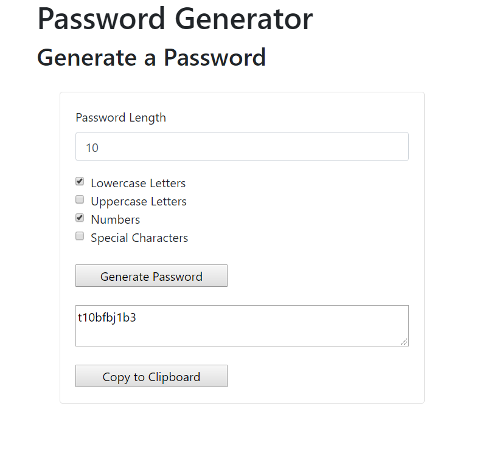

# Homework_03_JS_Password_Gen

This application is a random password generator using JavaScript. 
It will generate a random password based on user-selected criteria. This app will run in the browser and feature dynamically updated HTML and CSS powered by your JavaScript code.

The homework states to use propts to get user input on length and character types. I don't really like the prompt input so I used HTML form input instead. I did leave the prompts in the javascript as comments so you can see them if needed. Let me know if this is a problem and I can revise it to run off of the propts instead. 

The HTML form gathers the following criteria to generate the password from:

* Length (must be between 8 and 128 characters)
    Used number input with a backup if statement to restrict input to the correct length and to be a number. 

* Character type:

  * Special characters 
    * check box

  * Numeric characters
    * check box

  * Lowercase characters
    * check box

  * Uppercase characters
    * check box

